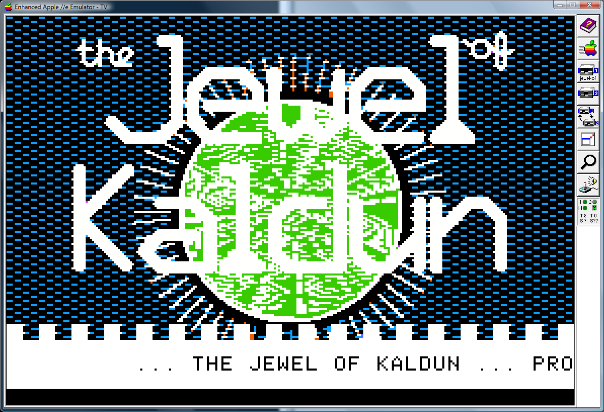
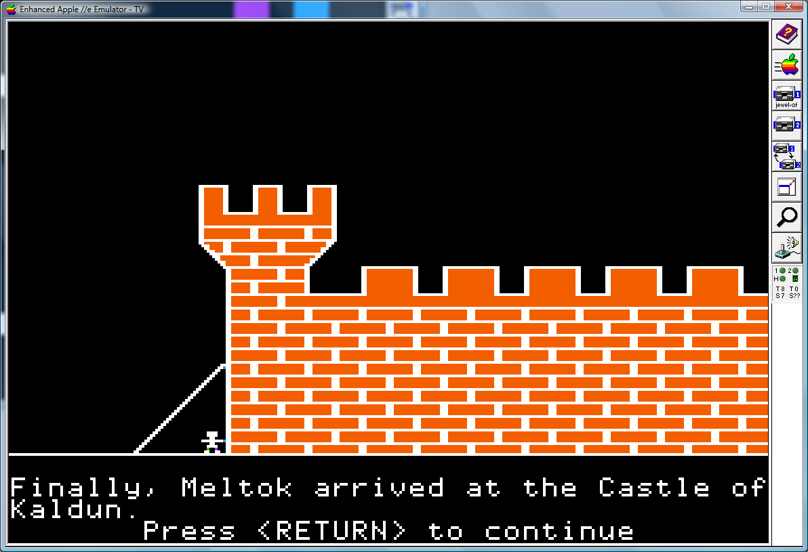
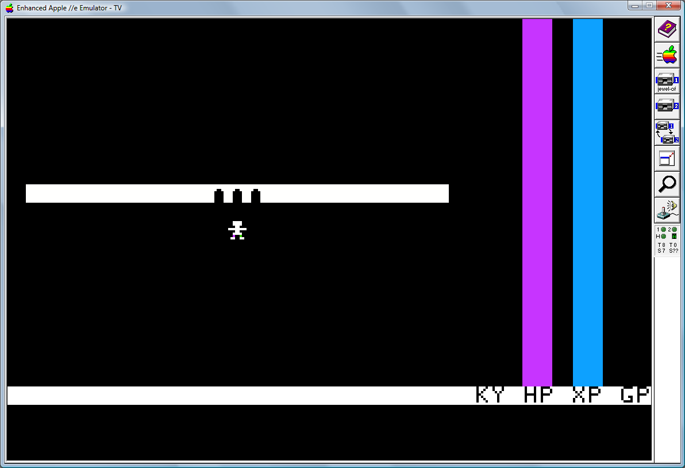
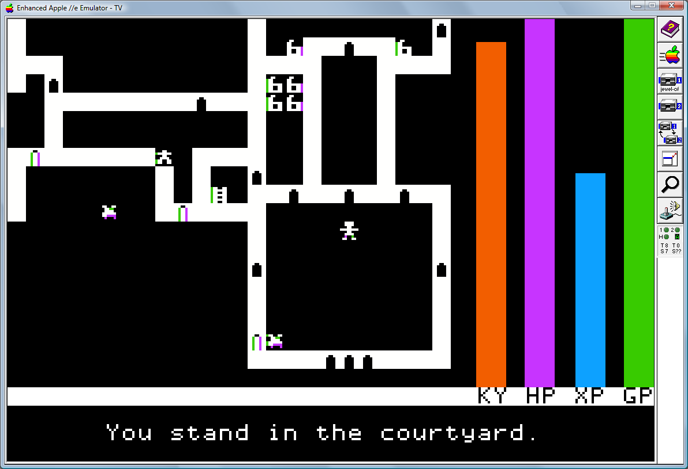
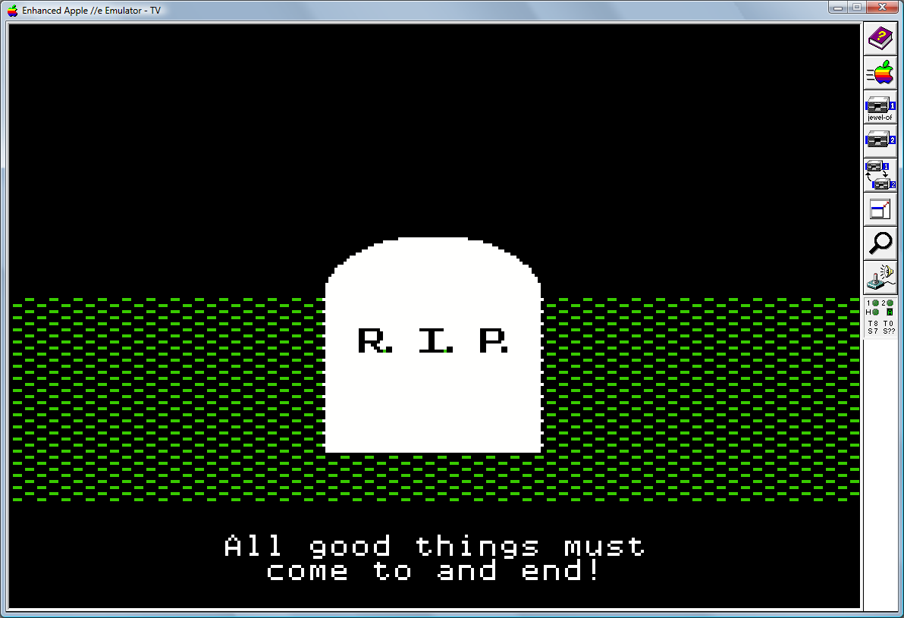

# Jewel of Kaldun

The Jewel of Kaldun is a game written in 1990.  It started off as a mostly Applesoft BASIC game but desperately needed to be redone in assembly.  This is the result.

## Screen Shots

The title screen (created via Applesoft BASIC and stored as a binary image on disk):



There is a background story to introduce the purpose and walk through game play.  In it, you are introduced to your avatar, Meltok:



There is rudimentary revealing of hte map... so when you start, all you see is the castle walls:



As the game is played, whatever parts of the map fit on the screen remain visible. Once it scrolls off, you will need to revisit it to remap it:



And, unfortunately, Meltok doesn't always make it!



## Conversion notes

Notes on the migration from classic Merlin to Merlin32:

* Extract source files as-is; some tools will want to format it.

* Use Cadius to format text; this is most useful initially as Cadius formats Merlin macros properly `MOVB A;B` remains as-is instead of becoming `MOVB A    ;B` which breaks the macro.

* Cadius writes out CR/LF, you may need dos2unix to fix this.

* Sharing one namespace for multiple binaries has changed....

This style of building a multiple file binary worked in the ProDOS variants of Merlin.  It would produce a FILE1.BIN and a FILE2.BIN.


```
            ORG   $1000
            DSK   file1.bin

            ...
            jsr   sub1
            ...

            ORG   $2000
            DSK   file2.bin

sub1        ...
```

In Merlin32, you must create a linkage source file which essentially contains the meta information for each binary (a direct copy from the Merlin32 documentation):

```
            *--------------------------*
            *         SEGMENTS         *
            *--------------------------*
            
                        TYP    $06            ; Binary File / Fixed Address
            
            *--------------------------
            *  Segment #1
            *--------------------------
            
                        ASM    seg-main.s     ; Master Source File for Segment #1
            
            *--------------------------
            *  Segment #2
            *--------------------------
            
                        ASM    seg-endgame.s  ; Master Source File for Segment #2
            
            *--------------------------
```

Note that, unfortunately, this makes the application have multiple namespaces.  Thus, any time you crossed between the two (or more) pieces of code, you now need to fix that. Have patience and be careful of `EQU` or `=`.

Use the `EXT` keyword to declare an external dependency:

```
sub1        EXT

            ORG   $1000
            DSK   main.bin

            ...
            jsr   sub1
            ...
```

And finally, declare externally referenced addresses with `ENT`:

```
            ORG   $2000
            DSK   endgame.bin

sub1        ENT
            ...
```

I should also point out that the details are in the Merlin32 documents.  It's a large topic, and there are a couple of places to really pay attention to... :-)

* Math appears to be 8-bit?  See MOVW macro and -8 being 00F8 instead of FFF8 in (shapes.s) for `ARRIVEC2` (arrive at castle #2). This was `MOVW #-8;XMELTOK` but that moved a #$00 and #$F8 instead of $FF; doing the math by hand resulted in `MOVW #$FFF8;XMELTOK` to fix.

## Notes
* `Makefile` is very rudimentary as I am not a Makefile type person and build is so fast it doesn't matter
* Pay attention to versions
* `Makefile` makes assumptions about where things are placed, correct as necessary

## Current setup(s)

### Windows

> Please note that this mixes the Cygin Unix-y path flavor with the Windows path flavor.  Java and Cadius (as they are a Windows applications) require Windows pathing instead of Unix pathing.  See the `Makefile` configuration section.

* Cygwin 64-bit
 * git
 * gcc (to compile Merlin32)
 * make
* Java (Windows version)
* AppleCommander 
* Merlin32
* Cadius to format code
* dos2unix to fix Cadius DOS files to Cygin Unix files

## Software required to build:
* [Merlin32](http://www.brutaldeluxe.fr/products/crossdevtools/merlin/index.html) by Brutal Deluxe (version 1.0)
* The command-line variant of [AppleCommander](https://sites.google.com/site/drjohnbmatthews/applecommander) (please note this project is using 1.3.5.14-ac and that the command-line options do vary across versions)
* Either a real Apple II or an emulator
* [Cadius](http://www.brutaldeluxe.fr/products/crossdevtools/cadius/index.html) by Brutal Deluxe

